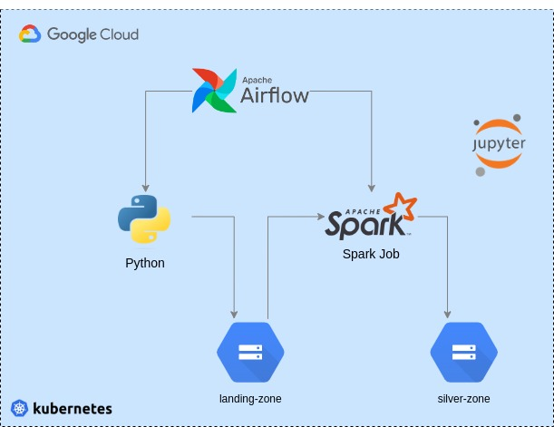

## Pipeline - Preços de Combustíveis

<p align="center">
    
</p>

**Fonte de dados** : <a href="https://dados.gov.br/dataset/serie-historica-de-precos-de-combustiveis-por-revenda" target="blank"><b>Série Histórica de Preços de Combustíveis</b></a>

### 1 - Pré-requisitos

* Criação do cluster GKE
* Criação da Service Account do Spark
* Criação da imagem de container do spark-operator
* Criação da imagem de container do notebook
* Criação dos buckets para as camadas landing e silver

### 2 - Deploy Airflow

```console
kubectl apply -f applications/airflow-prerequisites.yaml 

helm repo add apache-airflow https://airflow.apache.org

helm install airflow apache-airflow/airflow -f applications/airflow-values.yaml -n orchestrator 
```
* Configurar a connection `kubernetes_default`
* Cadastrar variável de ambiente `combustiveis_source_urls`

### 3 - Deploy do Spark Operator

```console
kubectl apply -f applications/spark-operator-prerequisites.yaml

kubectl create secret generic gcp-credentials --from-file="./config/key.json" -n processing

helm repo add spark-operator https://googlecloudplatform.github.io/spark-on-k8s-operator

helm install spark-operator spark-operator/spark-operator -n processing
```

### 4 - Deploy Pyspark Notebook

<a href="https://github.com/A3Data/pyspark-notebook-helm" target="blank"><b>Helm Chart para deploy do Pyspark Notebook no Kubernetes</b></a>

```console
kubectl create ns notebook

kubectl create secret generic gcp-credentials --from-file="./config/key.json" -n notebook

helm repo add pyspark-notebook https://a3data.github.io/pyspark-notebook-helm/

helm show values pyspark-notebook/pyspark-notebook  > applications/notebook-values.yaml

```
**Modificações no arquivo** `applications/notebook-values.yaml`:
* Alterar a imagem: `image.repository`, `image.tag`  
* Descomentar credenciais GCP: `env`, `extraVolumes`, `extraVolumeMounts`

```console
helm install pyspark-notebook pyspark-notebook/pyspark-notebook -f applications/notebook-values.yaml -n notebook
```
**Recuperação do token para acesso** 

```console
kubectl exec -it pod/pyspark-notebook-0 -n notebook -- bash

jupyter server list
```